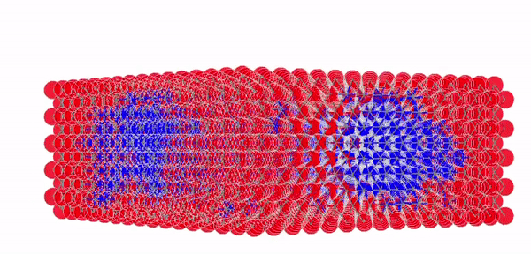

# Simulating thermodynamic oddities in non-random alloys and determining the percolation threshold within quantum wells
<p align="center">
  
</p>

## See examples now!

Open the visualising/html directory for a number of InGaN quantum wells that have undergone spinodal decomposition

## Analysing Percolation thresholds with Search Algorithms - COMING SOON

## Make your crystals
Run the makeQuantumWell.py script to create an NxNxM quantum well.
E.g) to get a quantum well with the dimensions 10x10x5 InGaN unit cells: run the code as follows:

``` 
$ python makeQuantumWellGraph.py 10 5
10x10x5-quantum-well-graph.gpickle
```

## Run the Rigorous Ising model to simulate annealing
The output file can then then be used as an argument for get_decomposition_sro.py 

``` 
$ python get_decomposition_sro.py 10x10x5-quantum-well-graph.gpickle
decomposed_10x10x5-quantum-well.gpickle, decomposed_10x10x5-quantum-well.xyz, sro_1-2-3-4.csv

```
The resulting microstructures can be visualised with any software that can view .xyz files - see the visualisation/plot_3d_model directory for examples.

It can be seen that decomposition has occurred by observing the large blue clusters of Indium within the red Gallium sublattice. 

This can be quantified by observing the evolution of the 4 short-range order parameters in the attached .csv files - plotted in /visualisation/plot_sro_parameter directory.

The short range order parameter (SRO) describes how Indium clusters are formed amongst their 4 nearest neighbours

## OS Compatibility

the output of makeQuantumWellGraph.py differs when build on windows and linux (tested on ubuntu 20.04 and windows 10)

This should not cause any issues as the graphs can be remade on any OS, as required.

