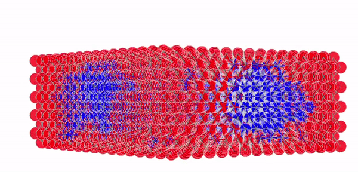

# How to analyse the percolation threshold of non-random alloys - InGaN



## See examples now!

Open the visualising/html directory for a few premade decomposed examples.

## Analysing Percolation thresholds with Search Algorithms COMING SOON

## Make your crystals
Run the makeQuantumWell.py script to create your own quantum well.
E.g) to get a quantum well which is 10x10x5 InGaN unit cells in size: run the code as follows:

``` 
python makeQuantumWellGraph.py 10 5
>>10x10x5-quantum-well-graph.gpickle
```
## Run the Ising model to simulate annealing
The output file can then then be used as an argument for getDecompositionCalculateSRO1.py 

Visualising the codes output can be done with any software that can view .xyz files - see the visualisation/xyz2graph directory for examples.

We can see that decomposition has occured by observing the large blue clusters of Indium within the Gallium sublattice. However it can be quantified by observing the evolution of the SRO parameter in the attached .csv files.

IF 0 < SRO_X < 1 --> The system has formed clusters

## OS Compatibility

the output of makeQuantumWellGraph.py differs when build on windows and linux (tested on ubuntu).

This should not cause problems as the graphs can be made on either OS as required.

